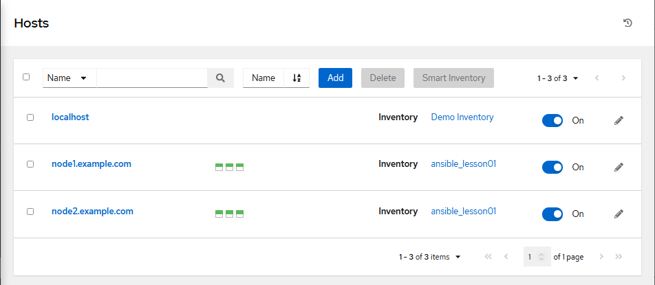
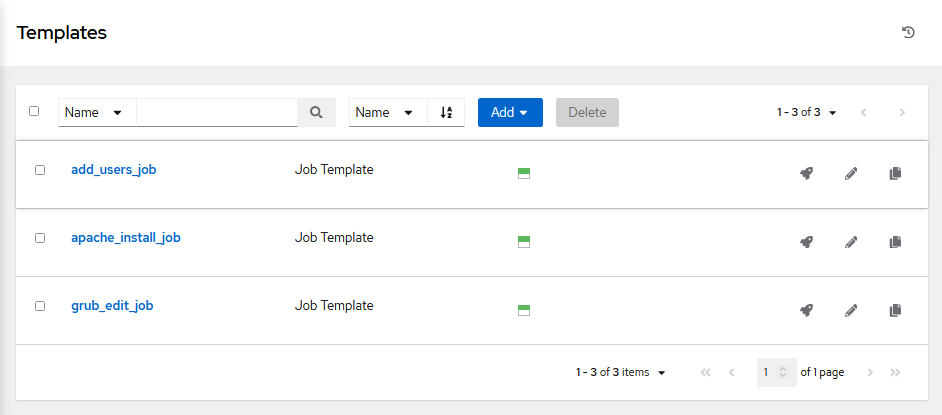
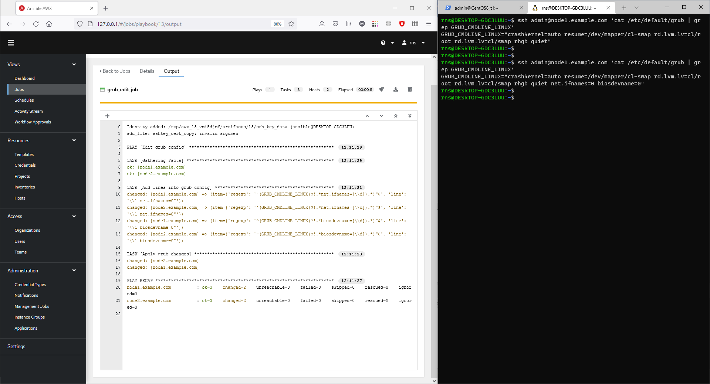
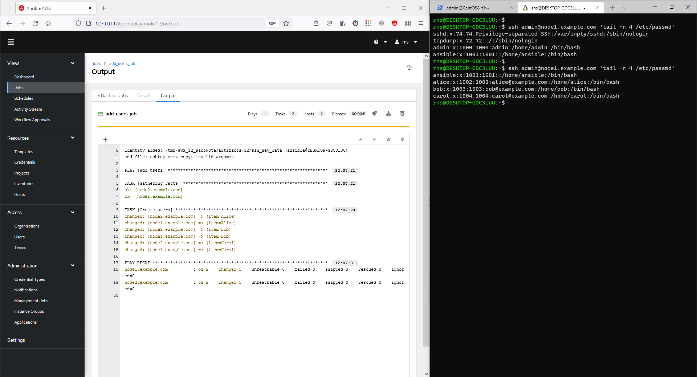
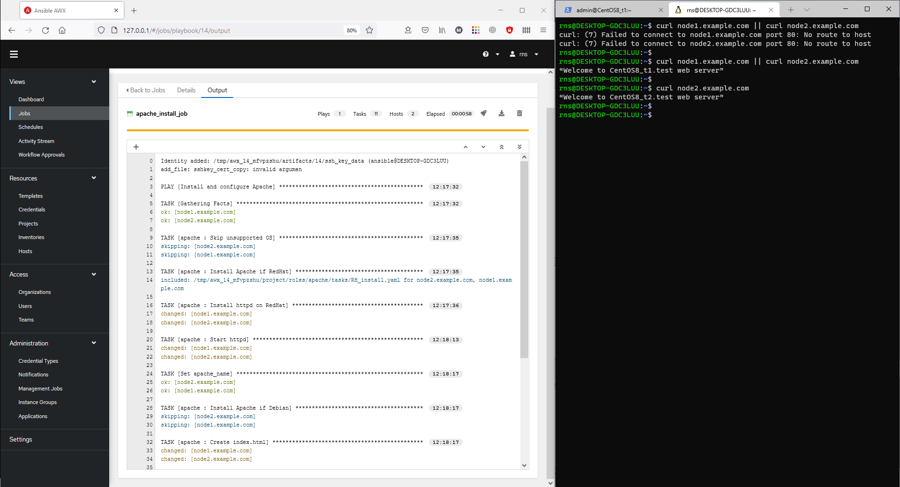
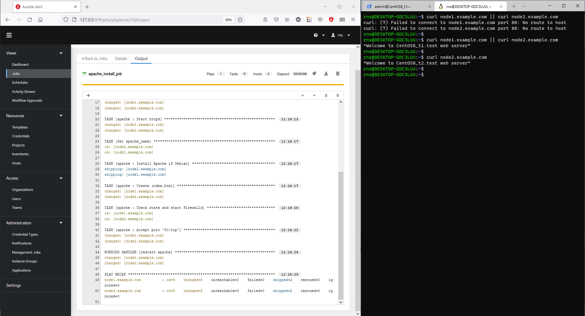
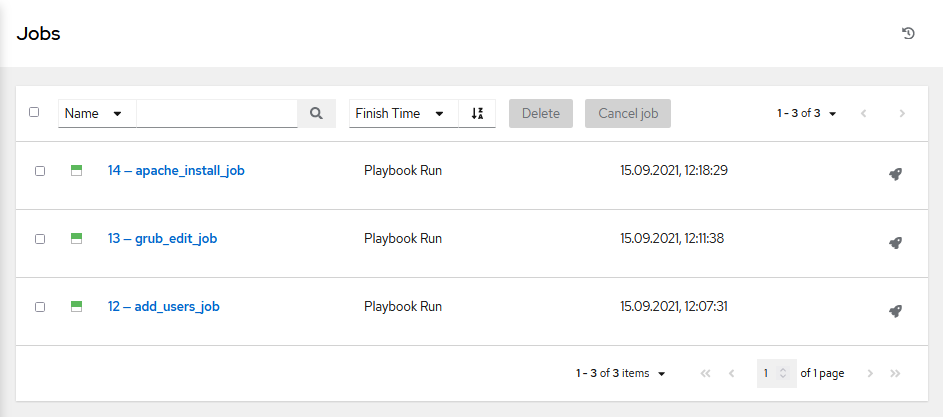

####Home task: \
Установить у себя в окружении AWX, создать там проекты со своими плейбуками и ролями, запустить их.\
В качестве результата нужно сделать скриншоты кода и результатов запуска. 

####Настройка:

####Выполнение:
1. Запускаем плейбук **grub_edit** из первого задания. \
Проверяем состояние файла /etc/default/grub командой: \
`cat /etc/default/grub | grep GRUB_CMDLINE_LINUX` 

2. Запускаем плейплейбук add_users из второго задания. \
Проверяем 4 последних пользователя в файле /etc/passwd: \
`tail -n 4 /etc/passwd` 

3. Запускаем роль apache_install из третьего задания. \
Проверяем доступность страницы командой: \
`curl node1.example.com || curl node2.example.com` 

 

 

4. Выполненные jobs: 

